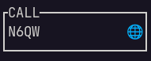
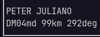
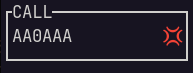

# K6GTE Field Day logger (Curses)

[](https://www.gnu.org/licenses/gpl-3.0)  [](https://www.python.org/downloads/)  [](https://docs.python.org/3/library/curses.html)

The logger is written in Python 3, and uses the curses lib. It will work with Linux and Mac, but since the Windows curses lib is lacking it will not work properly in Windows.

The log is stored in an sqlite3 database file 'FieldDay.db'. If you need to wipe everything and start clean, just delete this file. The screen size expected by the program is an 80 x 24 character terminal. Nothing needs to be installed, compiled etc... Just make FieldDayLogger.py executable and run it within the same folder.


## Caveats
This is a simple logger meant for single op. It's not usable for clubs, there is no provision made for aggregating log data from multiple sources.

# Recent changes

* Lots of PEP8 compliance work, except STUPID things like 'too-many-lines'.
* Placed things in classes, like CAT control, Callsign lookups, Database functions.
* Moved preferences out of the main DB, and into a JSON file.
* ReWorked scoring since rule changes for 2022.
* Moved call and grid lookups to a thread.
* Added CW macros. The macros are stored in cwmacros_fd.txt. This works in conjunction with [PyWinKeyerSerial](https://github.com/mbridak/PyWinKeyerSerial), [cwdaemon](https://github.com/acerion/cwdaemon) and [winkeydaemon](https://github.com/N0NB/winkeydaemon). See Initial Setup section for settings.
* Improved text entry and editing.
* Added auto-logging of FT8 contacts made with wsjt-x. 


# The basic functionality

## Commands:
Commands start with a period character in the callsign field and are immediately followed by any information needed by the command.

```
.H displays a short list of commands.
.Q Quit the program.
.Kyourcall Sets your callsign. .KK6GTE will set it to K6GTE.
.Cyourclass Sets your class. .C1E will set your class to 1E.
.Syoursection Sets your section. .SORG sets your section to ORG.
.P# Sets the power level, .P5 will set the power to 5 watts.
.MCW .MPH .MDI Sets the mode. CW Morse, PH Phone, DI Digital.
.B# sets the band, .B40 for 40 meters.
.D# Deletes log entry. .D26 will delete the log line starting with 026.
.E# Edits log entry. .E26 will edit the log line starting with 026.
.L Generate Cabrillo, ADIF and stats.
[esc] abort input, clear all fields.
```

After the command is entered press the TAB key to execute it.

For example, when I initially start the program I could enter the following:

```
.KK6GTE
.C1B
.SORG
.P5
.B40
.MCW
``` 
This says I'm K6GTE 1B ORG, running 5 watts CW on 40 Meters.

## Initial Setup
Before operating for the first time, you will need to edit the preference file that is in a JSON format. The file is named `./fd_preferences.json`. If it is not there or you mangle it badly, just delete it and run the logging program. Another one will be created for you.

Here's an example of it's contents:

```

{
    "mycall": "Call",
    "myclass": "Class",
    "mysection": "Section",
    "power": "100",
    "altpower": 0,
    "usehamdb": 0,
    "useqrz": 0,
    "usehamqth": 0,
    "lookupusername": "w1aw",
    "lookuppassword": "secret",
    "userigctld": 0,
    "useflrig": 0,
    "CAT_ip": "localhost",
    "CAT_port": 4532,
    "cloudlog": 0,
    "cloudlogapi": "c01234567890123456789",
    "cloudlogurl": "https://www.cloudlog.com/Cloudlog/index.php/api/",
    "cloudlogstationid": "",
    "usemarker": 0,
    "markerfile": ".xplanet/markers/ham",
    "cwtype": 0,
    "CW_IP": "localhost",
    "CW_port": 6789
}

```

The lines for your callsign, class, section, power are pretty self explanatory. The lines ending in a 0 or a 1 tell the program that you either want or do not want to use a certain feature.

For example the block:

```
    "usehamdb": 0,
    "useqrz": 1,
    "usehamqth": 0,
```

Tells the program that you want to use QRZ to look up the gridsquare and name of the contact. If the lookup service you choose needs credentials, put them in lookupusername and lookuppassword.

This block:

```
    "userigctld": 1,
    "useflrig": 0,
    "CAT_ip": "localhost",
    "CAT_port": 4532,
```

Says, of the two available CAT interface options, flrig or rigctld, I want to use rigctld. And it can be found on localhost:4532.

This block:

```
    "cwtype": 0,
    "CW_IP": "localhost",
    "CW_port": 6789
```

Is for the type of CW backend you are using. For cwdaemon or winkeydaemon set this to 1. Set this to 2 for PyWinkeyer. Leave as 0 if you are not using one. The CW_port can be set to 6789 for cwdaemon and winkeydaemon, 8000 for PyWinkeyer.

## Logging
Okay you've made a contact. Enter the call in the call field. As you type it in, it will do a super check partial (see below). Press TAB or SPACE to advance to the next field. Once the call is complete it will do a DUP check (see below). It will try and Autofill the next fields (see below). When entering the section, it will do a section partial check (see below). Press the ENTER key to submit the Q to the log. It can send contact to Cloudlog (see below). If it's a busted call or a dup, press the ESC key to clear all inputs and start again.

## Features

#### Radio Polling via rigctld or flrig
If you run rigctld or flrig on the computer that you are logging from, the radio will be polled for band/mode updates automatically. There is an indicator at the bottom of the logging window to indicate polling status. Dim if no connection or timeout, and highlighted if all okay.


#### CW macros
The macros are stored in the cwmacros_fd.txt file. The fields to edit are pretty straightforward. Each line has 3 fields separated by the pipe `|` character. The first is the Fkey being assigned. The second is a useless label. The third is the actual macro. the bits between the curly braces gets replaced by actual values

`F1|Run CQ|cq fd {MYCALL} {MYCALL} k`

#### Callsign lookups:
An option of callsign lookups for gridsquare and op name is offered by one of three services: QRZ, HamDB or HamQTH. The use of these can be turned on or off by editing the JSON preference file. The lookup happens in it's own thread and is kicked off after the cursor leaves the call field. You'll see an indicator in the call field that the look up is in progress. 

 

If the look up is successful, the icon in the call field will change.



And you'll see the status line at the bottom change giving you name, grid, bearing and distance to contact.



If the lookup fails. you will see:



#### WSJT-X FT8
We monitor the multicast address used by wsjt-x for UDP packets. If the packet says we've made a contact, we automatically add the contact to the Field Day log.

#### Cloudlog
If you use Cloudlog, contacts can be pushed to your Cloudlog server.
The use of this can be turned on or off by editing the JSON preference file.


#### Editing an existing contact
Use the Up/Down arrow keys or PageUp/PageDown to scroll the contact into view. Your mouse scroll wheel may work as well. Double left click on the contact to edit, or use the '.E' command. Use the TAB or Up/Down arrow keys to move between fields. Backspace to erase and retype what you need.
Once done press the Enter key to save, or the Escape key to exit.


#### Super Check Partial
If you type more than two characters in the callsign field the program will filter the input through a "Super Check Partial" routine and show you possible matches to known contesting call signs. Is this useful? Doubt it.


#### Section partial check
As you type the section abbreviation you are presented with a list of all possible sections that start with what you have typed.


#### DUP checking
Once you type a complete callsign and press TAB or SPACE to advance to the next field. The callsign is checked against previous callsigns in your log. It will list any prior contact made showing the band and mode of the contact. If the band and mode are the same as the one you are currently using, the listing will be highlighted, the screen will flash, a bell will sound to alert you that this is a DUP. At this point you and the other OP can argue back and forth about who's wrong. In the end you'll put your big boy pants on and make a decision if you'll enter the call or not.


#### Autofill
If you have worked this person before on another band/mode the program will load the class and section used previously for this call so you will not have to enter this info again.

#### The Log
If you've gotten this far I commend you. Let's hope this part actually works, 'cause if you spent 24 hours yelling into a mic, tapity tap taping a Morse key and clickity click clicking on an FT8 screen and all you get is 'sad trombone'... Well...

The command '.L' will as far as I can tell generate a Cabrillo log file which you should edit to add your name, email address, home address and possible club affiliation. It will also generate a statistics file with a band/mode breakdown, which is something you'll have to hand enter on the ARRL submission page.

I've used cr/lf line endings because that's what the log checker expects. So if you edit the file you might want to run the file through 'unix2dos' to make sure the checker does not choke. 

I've added an ADIF export of sorts. There's a logistical problem with data modes. Field Day does not care what the data mode is, it's just recorded as a generic data contact. So I didn't bother to capture that in the database. So since most of america and maybe canada will use FT8 because it's the new hotness, I just made the data contacts map over to FT8 in ADIF. Sorry. 
